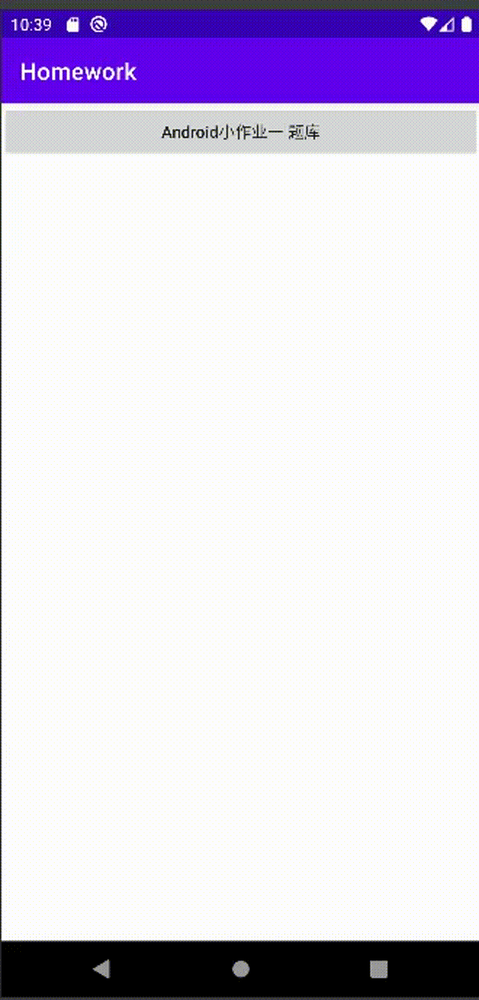
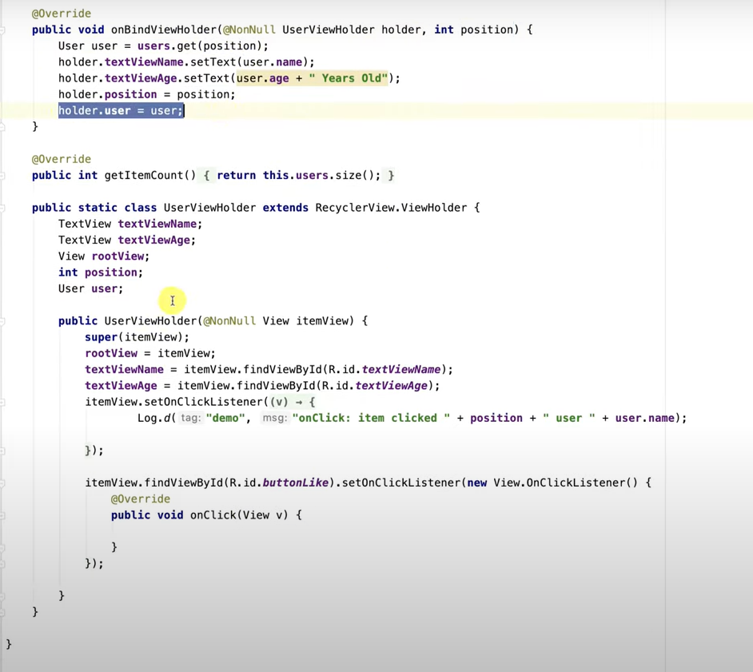

# Homework1

>题库应用

## 0. 预览效果



## 1. 页面布局

两个页面

一个是用cycle的题目概览

一个页面是题库的详细信息页

## 2. 功能

步骤

1. 布局
2. 按钮跳转
3. 加上数据
   1. 在.kt文件中引入数据
   2. 在adapter中将数据和ViewHolder一一对应，
   3. 点击按钮 之后的数据如何和其一一对应，按钮对应的事件和传入的数据要如何设计？

## 3. 用到的功能模块

* activity
* cycleview，其中的每一项用item_layout进行设置

**用到的一些设置方法**

```kotlin
 android.widget.TextView.setAllCaps(boolean AllCaps) // TextView中字母大小写设置
```

**点击跳转**

在ViewHolder里添加点击事件跳转到新的页面

1.自定义listener变量 并传入这个项的position值

类似[Adding Buttons in RecyclerView Row Items](https://www.youtube.com/watch?v=FA5cGLLiSWs)



recycleView Click

2.ListView本身就有onItemClick的方法


**参考链接**

[Android启动Activity的两种方式与四种启动模式](https://www.cnblogs.com/chenxibobo/p/6136626.html)

[Android Studio 点击按钮跳转新界面](https://www.cxyzjd.com/article/nuannuanloveai/83786032)

[Android中点击按钮启动另一个Activity以及Activity之间传值](https://blog.csdn.net/BADAO_LIUMANG_QIZHI/article/details/103919470)

[Android ListView Tutorial with Kotlin](https://www.raywenderlich.com/155-android-listview-tutorial-with-kotlin)

[How to add onClick to RecyclerView list items in Kotlin](https://www.raywenderlich.com/155-android-listview-tutorial-with-kotlin#toc-anchor-009)
