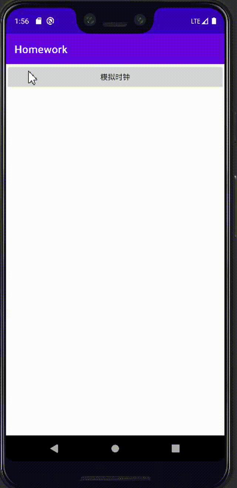

# 时钟App

1. 绘制时钟界⾯，包括表盘、时针、分针、秒针
2. 时针、分针、秒针需要跳动
加分项：
按需增加表盘数字
在上/下⽅实现⼀个电⼦表，与机械表联动
可以实现切换到⼿动拨动指针的模式（需要⾃学Android touch事件）
减分项：
程序会在某些情况下崩溃

## Step

1. 自定义两个view
2. 定义一些

> ————
>
> | 闹钟   |
>
> ————
>
> | 数字   |
>
> ————

## 演示

