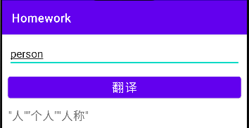
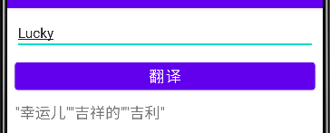

# 翻译官App

>  题目：翻译官App
> 要求使用公共API ： https://www.free-api.com/use/525 编写一个
> 具有简单翻译功能的App，然后使用Charles 或者WireShark对请求进行抓包，导出抓包文件。
> 说明：因为字段非常多，大家可以选择性的使用。UI的绘制上可以参考市面
> 主流的一些翻译App。
> 评分标准：
> 1、具备基本翻译功能并正确抓取到数据包为及格
> 2、视功能丰富程度可适当加分
> 3、具备重复请求缓存功能加分
> 4、具备流量统计功能加分
> 5、能抓取完整的DNS、TCP、TLS连接包的有加分

添加权限，增加第二个权限是为了解决可能的[socket failed: EPERM (Operation not permitted)](https://stackoverflow.com/questions/56266801/java-net-socketexception-socket-failed-eperm-operation-not-permitted)

```bash
<uses-permission android:name="android.permission.INTERNET" />
<uses-permission android:name="android.permission.ACCESS_NETWORK_STATE" />
```

可以使用的api

```bash
https://dict.youdao.com/jsonapi?q=name
https://fanyi.youdao.com/translate?&doctype=json&type=AUTO&i=what%27s%20your%20name
```

运行结果展示



