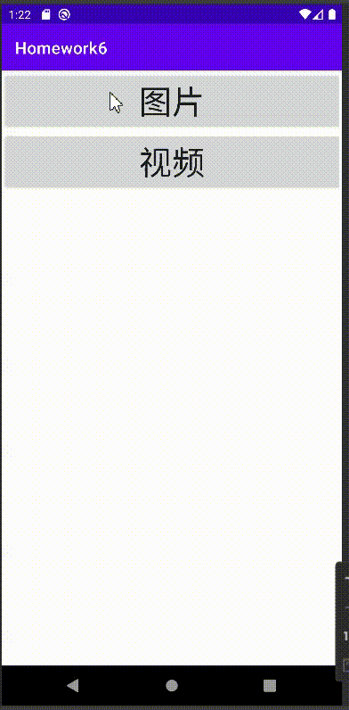
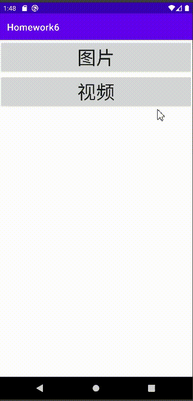

# 播放器

> 图⽚部分
>
> * ⽹络图⽚展示(动图+静图)
> * ⽀持左右滑动切换展示不同图⽚
> * (选做)⽀持⼿势控制，包括放⼤、缩⼩、平移
>
> 视频部分
>
> * 播放、暂停、重播功能；
> * 播放进度条展示（包括时间显示）、点击/滑动跳转到指定位置。
> * (选做)横竖屏切换、横屏时展示全屏模式。

## 0. 预览效果

完成除选做部分外的所有部分

图片部分

视频部分

**PS**

进行了一个并不怎么成功的尝试

由于android9之后采用https，若需要加载网络图片http，需要在res文件夹下创建并进行相应设置，具体设置方法可以参考第一条参考链接。

或者参考第二条链接，在application设置`android:usesCleartextTraffic="true"`

最后通过将虚拟机格式化，才可以得到正常效果

**参考链接**

1. [Android Glide加载图片、网络监听、设置资源监听](https://cloud.tencent.com/developer/article/1768919)
2. [【完美解决】Failed to open QEMU报错](https://blog.csdn.net/xbean1028/article/details/105424393)