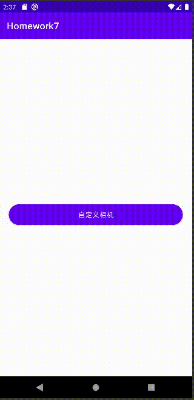

# 自定义相机拍摄照片和视频

要求

:white_check_mark:解决权限申请问题

:white_check_mark:拍摄并正常显示

:white_check_mark:拍摄一段视频并能播放

:black_square_button:选做（预览使用TextureView代替SurfaceView)

## 0. 预览效果

## Tips

按住shift可以操作adb摄像头视角